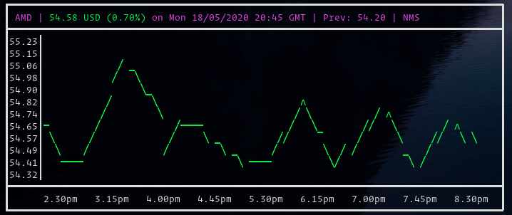
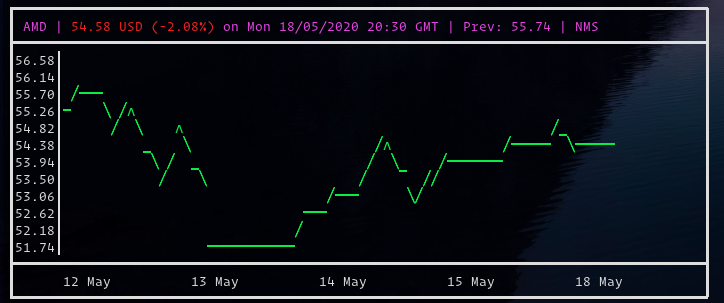

# 

[](https://github.com/ericm/stonks/blob/master/LICENSE)
[](https://github.com/ericm/stonks/graphs/contributors)
[](https://github.com/ericm/stonks/commits/master)
[](https://github.com/ericm/stonks/releases)
[](https://aur.archlinux.org/packages/stonks/)

Stonks is a terminal based stock visualizer and tracker.

## Installation

Requirements: golang >= 1.13

### Manual

1. Clone the repo
2. Run `make && make install`

### Packages

Stonks is available on:

- [The AUR](https://aur.archlinux.org/packages/stonks/). You can install it on arch linux with my other project [yup](https://github.com/ericm/yup): `$ yup -S stonks`

- HomeBrew: `brew install ericm/stonks/stonks`

## Usage

It uses Yahoo Finance as a backend so use the ticker format as seen on their website.

```
Displays realtime stocks in graph format in a terminal

Usage:
  stonks [flags]

Flags:
  -d, --days int          Stocks from X number of days ago.
  -h, --help              help for stonks
  -i, --interval string   stonks -i X[m|h] (eg 15m, 5m, 1h, 1d) (default "15m")
  -n, --name string       Optional name for a stonk save
  -r, --remove string     Remove an item from favourites
  -s, --save string       Add an item to the default stonks command. (Eg: -s AMD -n "Advanced Micro Devices")
  -t, --theme string      Display theme for the chart (Options: "line", "dot", "icon") (default "line")
  -v, --version           stonks version
  -w, --week              Display the last week (will set interval to 1d)              
  -y, --year              Display the last year (will set interval to 1mo)
      --ytd               Display the year to date (will set interval to 1mo)
```

### `$ stonks`

Gives graphs and current value/change of _saved_ stocks.


### `$ stonks -s AMD -n "Advanced Micro Devices"`

Add a favourite stock to be tracked with `$ stonks`

### `$ stonks -r AMD`

Remove a favourite stock

### `$ stonks AMD`

Gives the current stock for each ticker passed that day



### `$ stonks -w AMD`

Gives the current stock for each ticker passed _for the passed week_



### `$ stonks -d 4 AMD`

Gives the current stock for each ticker passed X days ago


## Configuration

The config file is located at `~/.config/stonks.yml`

You can change the following options:

```yml
config:
  default_theme: 0 # 0: Line, 1: Dots, 2: Icons
  favourites_height: 12 # Height of the chart in each info panel
  standalone_height: 12
```
